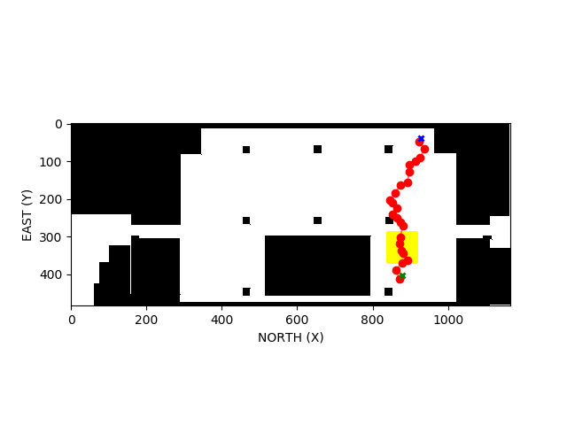
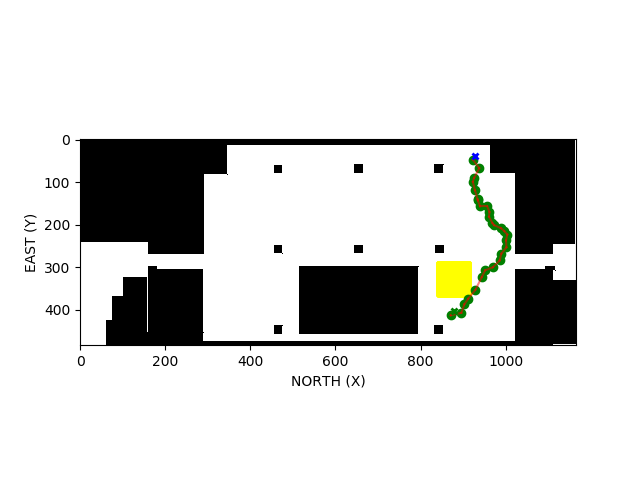

# Map:
The 2.5D map is created to find the shortest path between source and destination so that the obstacles in the indoor environment can be visualized.

# Data collection:

Data is collected from Blueprint of the indoor building and converted into usable data through Labelling and further converted into CSV file using python to create a 2.5D map.

# Data processing:

With the help of python, data processing is done for the data that has been fetched from CSV file.

# Shortest path:
<ol>
<li>All the possible paths are traced with the help of KDTree. </li>
<li>The shortest path has been found with the help of A* algorithm.</li>
</ol>

# API:

URL-  http://10.44.27.77:5000/source/destination/altitude_height_of_drone/cubical_under_fire 

By providing the source, destination and altitude_height of drone given in the form of addresses, hit the above-mentioned URL.  
For example:  http://10.44.127.16:5010/c3/c30/56/c6 
By hitting this URL, in response the required waypoints and 2 maps are generated
<ol>
<li>The first map generated contains data for 2.5D including various nodes in red colour dots with source and destination markers. 
 </li>
<li>The second map contains the shortest path from source to destination including the area where fire is taking place(represented in yellow colour).

<li>Since the drone trajectory contains fire, we must reroute it in other path where drone trajectory    doesn’t have fire. The following trajectory is new one, where drone doesn’t have fire in it’s trajectory. 

</ol>