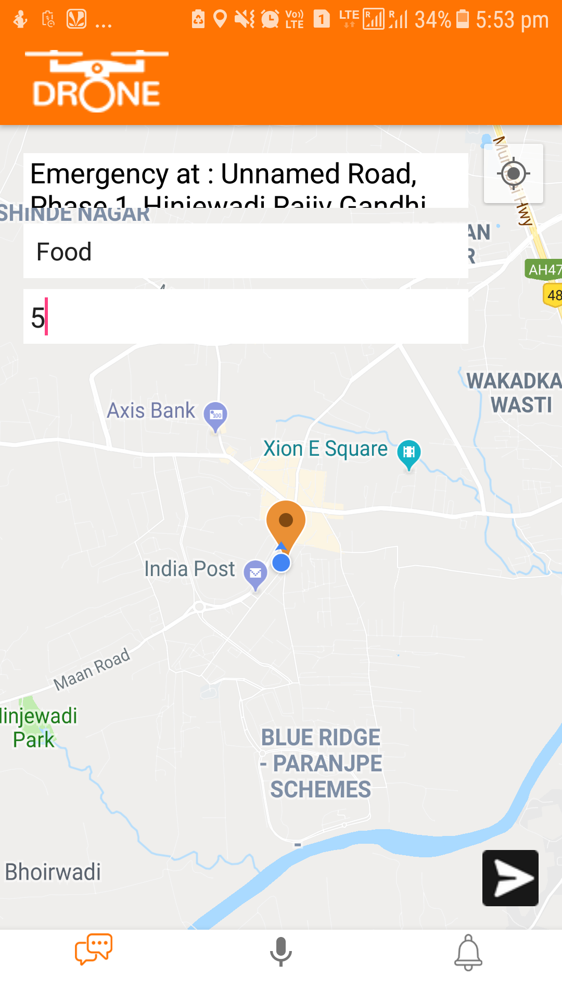
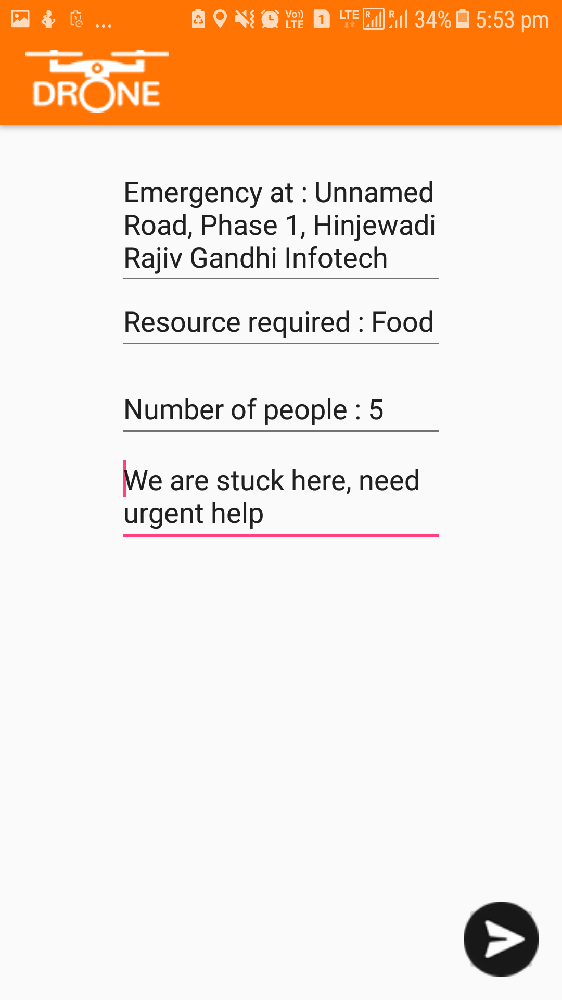

# Drone Android app
Android app for sending outdoor service request to drone in case of emergency.
#Prerequisite
Following server need to be in running state. 
<ul>
<li>Drone server : https://flaskapi.eu-gb.mybluemix.net/requests</li>
<li>IBM Speech to text server.</li>
</ul>

# Requirements
<ul>
<li>Android 4.4 Kitkat or higher.</li>
<li>Internet connection.</li>
</ul>

# Permissions required
<ul>
<li>Location</li>
<li>Internet</li>
<li>Storage</li>
<li>Record Audio</li>
</ul>

# Usage instructions
User need to enter material required and number of people. On clicking on send button, the information will be sent to drone server. Also user can give voice instructions and IBM Speech to text server will convert it and returns a text on chat screen. 
 
Voice note can be reviewed on next page and could be sent to server by clicking on sent button. 
