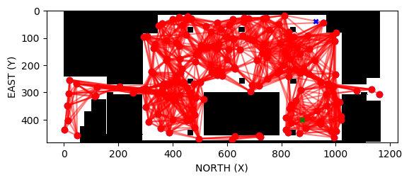
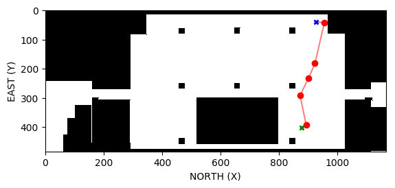
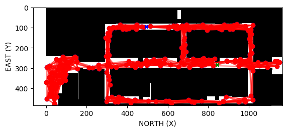
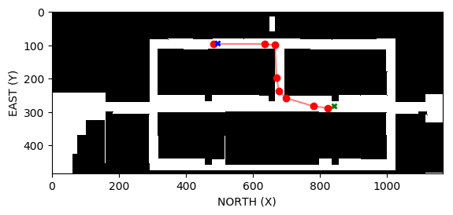

# Map:

The 2.5D map is created to find the shortest path between source and destination so that the obstacles in the indoor environment can be visualized.

# Data collection:

Data is collected from Blueprint of the indoor building and converted into usable data through Labelling and further converted into CSV file using python to create a 2.5D map.

# Data processing:

With the help of python, data processing is done for the data that has been fetched from CSV file.

# Shortest path:
<ul>
<li>All the possible paths are traced with the help of KDTree.</li>
<li>The shortest path has been found with the help of A* algorithm.</li>
</ul>

# API:
## For Drone altitude of 56(above cubicle height): 
URL-  (http://10.44.27.77:5000/source/destination/altitude_height_of_drone) 
By providing the source (cubicle number), destination (cubicle number) and altitude_height of drone given in the form of addresses, hit the below-mentioned URL. 
For example:  http://10.44.127.16:5010/c3/c30/56

By hitting this URL, in response the required waypoints and 2 maps are generated.
<ol>
<li>The first map generated contains data for 2.5D including various nodes with all possible connections in red colour lines with source and destination markers. 

</li>
<li>The second map contains the shortest path from source to destination. 

</li>
</ol>

## For Drone altitude of 15(below cubicle height): 
URL-  http://10.44.27.77:5000/source/destination/altitude_height_of_drone 
By providing the source (waypoints), destination(waypoints) and altitude_height of drone given in the form of addresses, hit the below-mentioned URL.
For example:  http://10.44.127.16:5010/p1/p6/15

By hitting this URL, in response the required waypoints and 2 maps are generated.

<ol>
<li>The first map generated contains data for 2.5D including various nodes with all possible connections in red colour lines with source and destination markers. 
    
</li>
<li>The second map contains the shortest path from source to destination. 

</ol>
&nbsp; All the maps generated are visualized with the help of MATPLOTLIB( python).