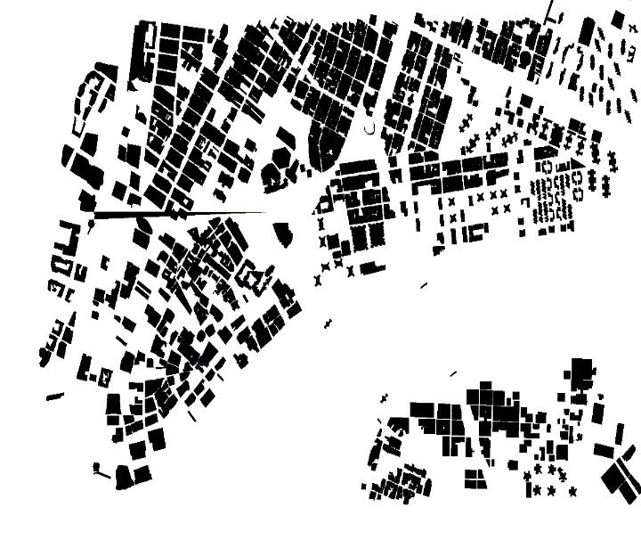
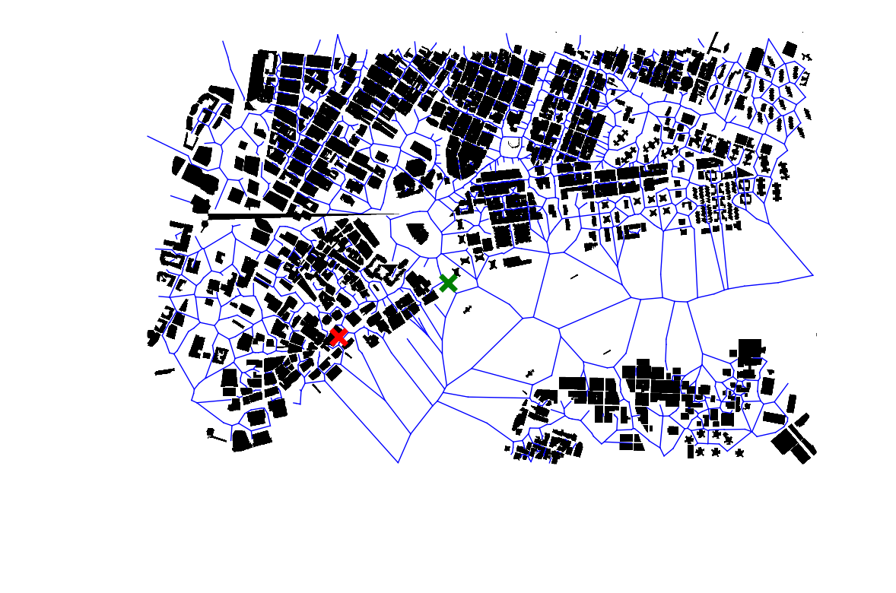
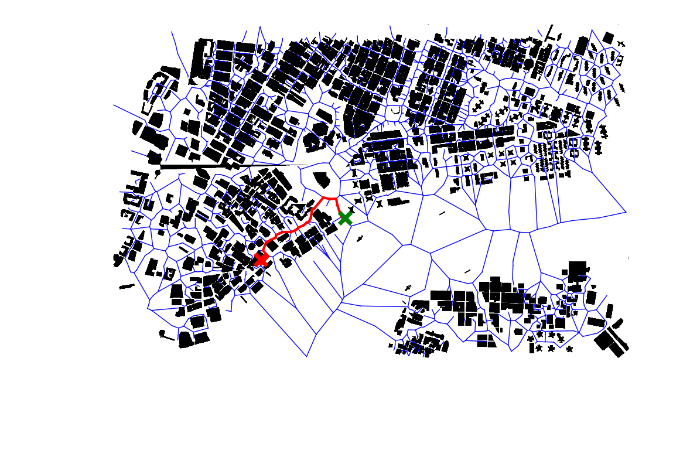

## Map:
The 2.5D map is created to find the shortest path between source and destination so that the buildings and other obstacles in the outdoor environment can be visualized.
## Data collection:
Data is collected from OSM (Open Street Map) to create a 2.5D map.
## Data processing:
With the help of QGIS and python code, data processing is done that has been fetched from OSM.
## Shortest path:
<ol>
<li> All the possible paths are traced with the help of Voronoi Diagram. </li>
<li>The shortest path has been found with the help of A* algorithm.</li>
</ol>

## API: 
URL-  http://10.44.27.77:5000/source/destination 
By providing the source and destination given in the form of addresses, hit the above-mentioned URL. 
The 3 maps are:
<ol>
<li>The first map generated contains data for 2.5D. 
</li>
<li>The second map contains all the possible paths marked with source and destination. 
</li>
<li>The third map contains the shortest path. 
</li>
</ol>
&nbsp; All the maps generated are visualized with the help of MATPLOTLIB( python).